<div align="center">

# 💸 SpendWise AI

**AI destekli kişisel finans takip uygulaması**

[](https://android.com)
[](https://kotlinlang.org)
[](https://developer.android.com/jetpack/compose)
[](https://firebase.google.com)
[](https://deepmind.google/gemini)

*Harcamalarını doğal dille yaz, AI otomatik analiz etsin.*

</div>

---

## 📱 Ekran Görüntüleri

<div align="center">

### Ana Sayfa

<table>
  <tr>
    <td align="center">
      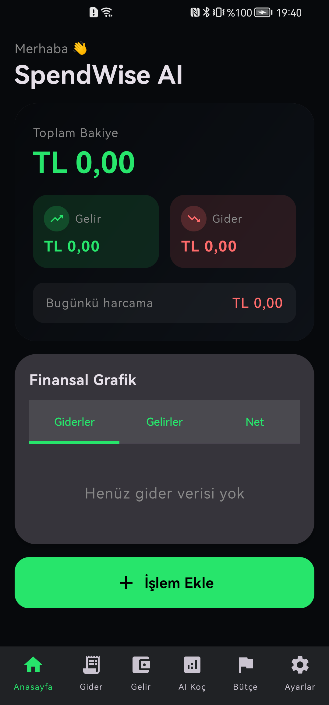<br/>
      <sub><b>Ana Sayfa (Boş)</b></sub>
    </td>
    <td align="center">
      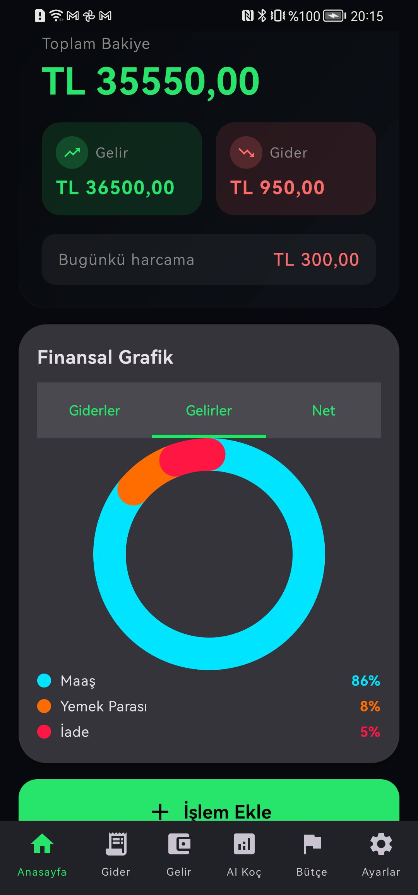<br/>
      <sub><b>Ana Sayfa + Gelir Grafiği</b></sub>
    </td>
    <td align="center">
        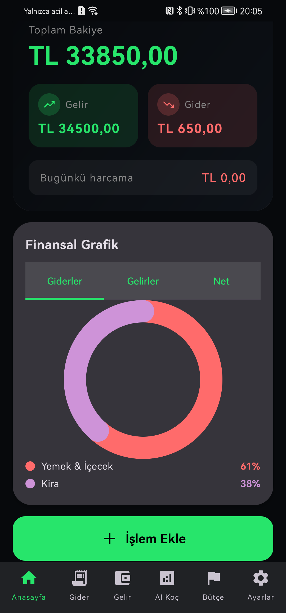<br/>
      <sub><b>Ana Sayfa + Gider Grafiği</b></sub>
    </td>
    <td align="center">
      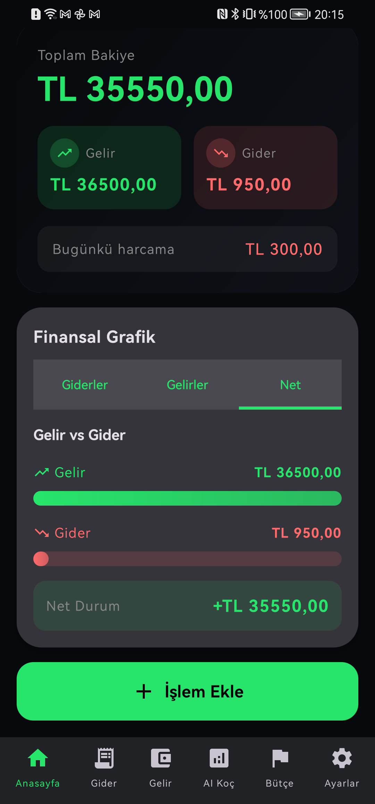<br/>
      <sub><b>Ana Sayfa + Net Grafik</b></sub>
    </td>
  </tr>
</table>

### İşlemler

<table>
  <tr>
    <td align="center">
      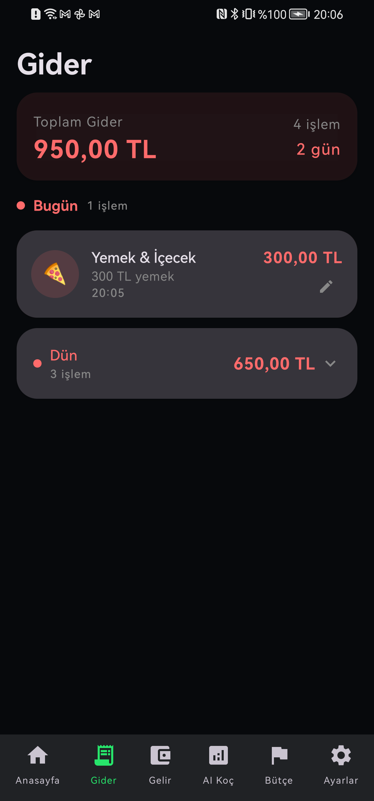<br/>
      <sub><b>Gider Detay</b></sub>
    </td>
    <td align="center">
      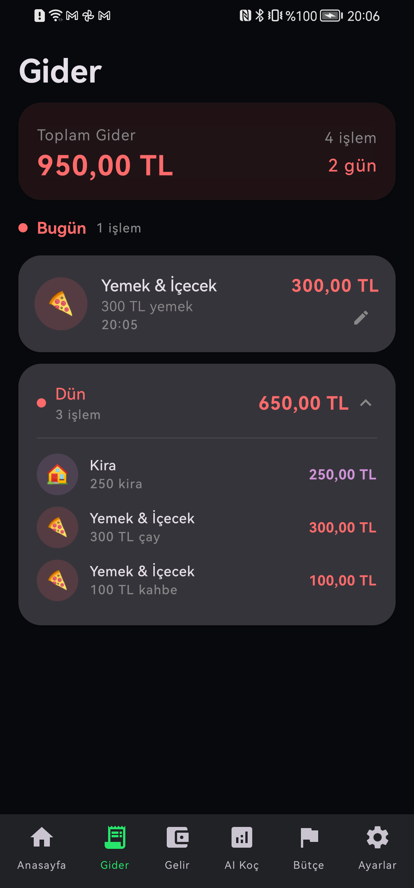<br/>
      <sub><b>Gider Genişletilmiş</b></sub>
    </td>
    <td align="center">
      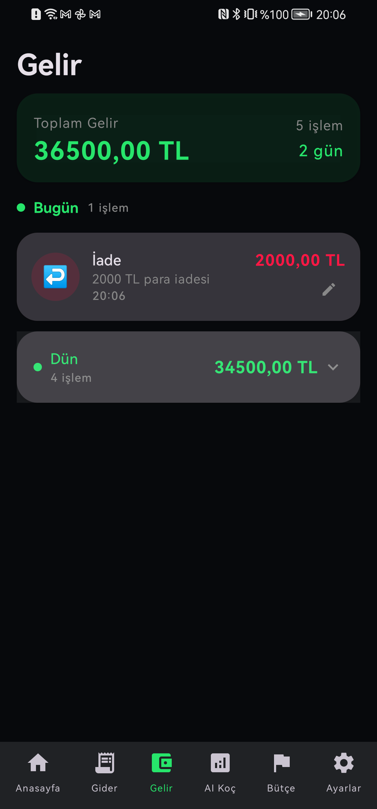<br/>
      <sub><b>Gelir Listesi</b></sub>
    </td>
    <td align="center">
      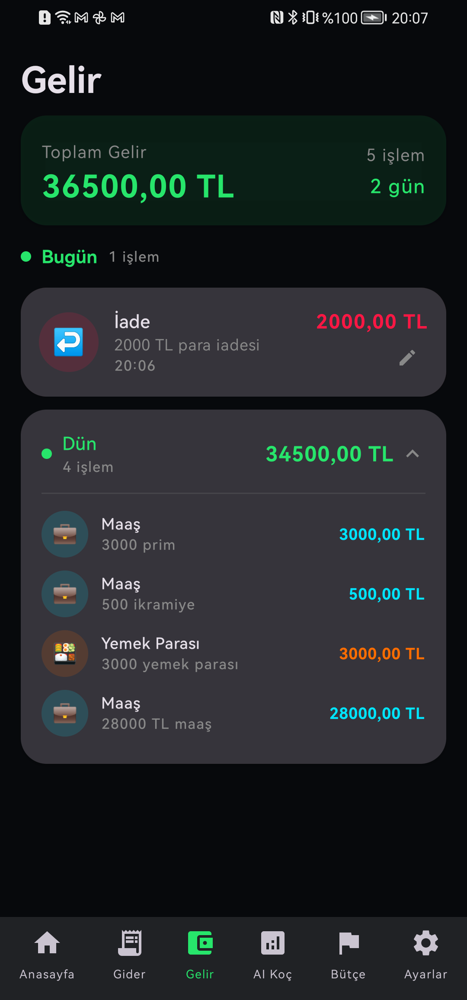<br/>
      <sub><b>Gelir Detay</b></sub>
    </td>
  </tr>
</table>

### AI Koç & Bütçe

<table>
  <tr>
    <td align="center">
      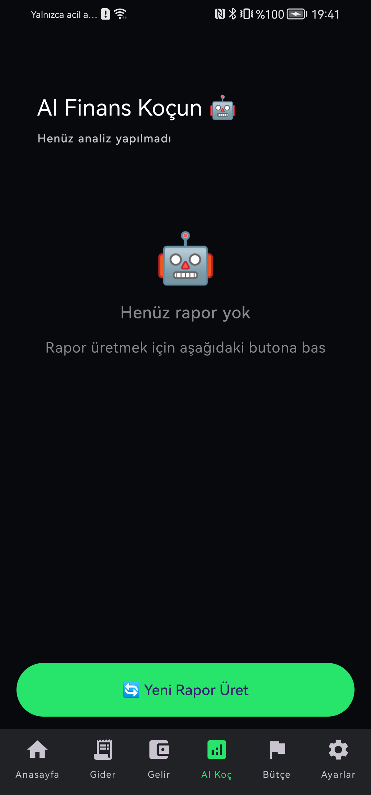<br/>
      <sub><b>AI Koç (Boş)</b></sub>
    </td>
    <td align="center">
      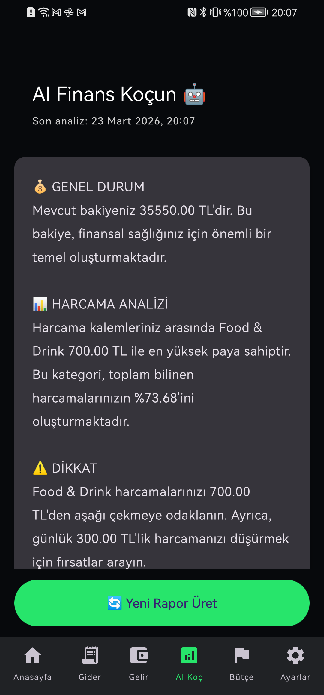<br/>
      <sub><b>AI Finans Koçu</b></sub>
    </td>
    <td align="center">
      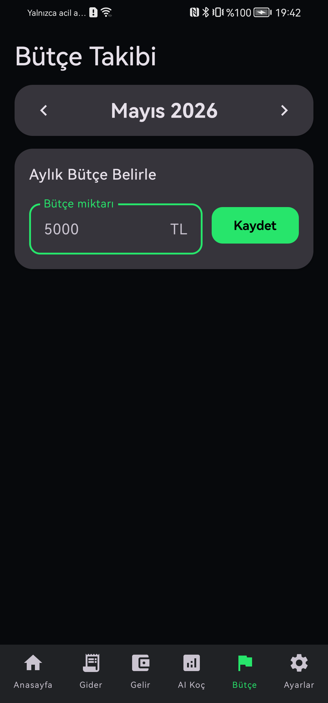<br/>
      <sub><b>Bütçe (Boş)</b></sub>
    </td>
    <td align="center">
      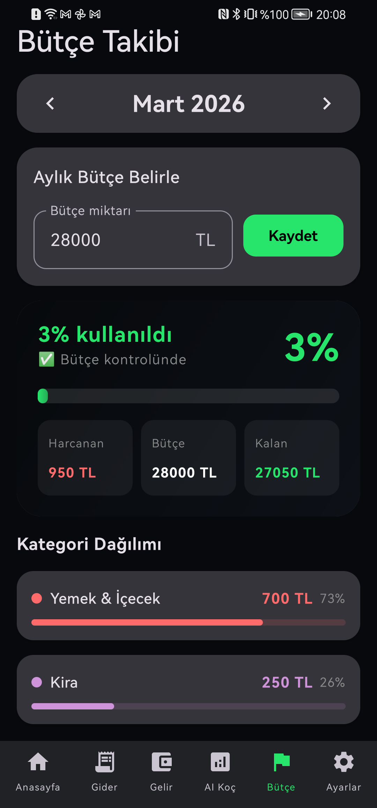<br/>
      <sub><b>Bütçe Takibi</b></sub>
    </td>
  </tr>
</table>

### Diğer

<table>
  <tr>
    <td align="center">
      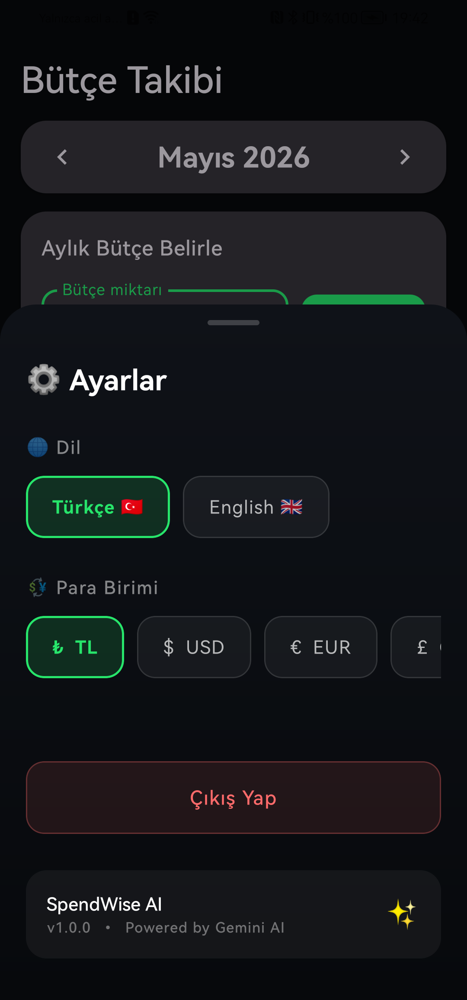<br/>
      <sub><b>Ayarlar</b></sub>
    </td>
  </tr>
</table>

</div>

---

## ✨ Özellikler

### 🤖 Yapay Zeka ile Harcama Girişi
Sadece ne harcadığını yaz, AI gerisini halleder:
```
"Migros'ta 340 TL market yaptım"  →  Market / 340 TL / Gider
"Maaş 18000 TL geldi"             →  Maaş / 18000 TL / Gelir
"Starbucks kahve 95 TL"           →  Yemek & İçecek / 95 TL / Gider
```
- **Google Gemini 2.5 Flash** — hızlı ve akıllı kategori tespiti
- **Regex fallback** — internet kesilse de çalışmaya devam eder
- 17 farklı kategori otomatik tespit edilir

### 📊 Finansal Takip
- Gelir & gider kaydı, **anlık bakiye** hesaplama
- **Donut grafik** — kategorilere göre harcama dağılımı
- **Net durum** — gelir vs gider karşılaştırması
- Günlük / geçmiş günlere göre gruplandırma
- Swipe ile silme, düzenleme

### 🎯 Bütçe Yönetimi
- Aylık bütçe limiti belirle
- Gerçek zamanlı harcama takibi (% olarak)
- Limite yaklaşınca ⚡ uyarı, aşınca ⚠️ uyarı
- Kategori bazlı bütçe dağılımı + progress bar

### 🤖 AI Finans Koçu
- Harcama verilerini Gemini ile analiz eder
- Kişiselleştirilmiş tasarruf önerileri sunar
- Somut rakamlarla hedef belirler
- Türkçe detaylı rapor üretir

### 🔄 Bulut Senkronizasyonu
- **Firebase Firestore** — telefon değişse bile veriler kaybolmaz
- Her işlem anında buluta yedeklenir
- **Kullanıcıya özel veri izolasyonu** — farklı hesaplar birbirini görmez
- Offline çalışma desteği (Room)

### 🔐 Kimlik Doğrulama
- **Google ile tek tuşla giriş**
- E-posta / şifre ile kayıt ve giriş
- Firebase Authentication altyapısı

### 🌍 Çoklu Dil & Para Birimi
- 🇹🇷 Türkçe / 🇬🇧 İngilizce
- TL · USD · EUR · GBP
- Anlık dil değiştirme

---

## 🏗️ Mimari

```
┌─────────────────────────────────────────────────────────┐
│                      UI Layer                           │
│                                                         │
│   LoginScreen   HomeScreen   AddExpenseScreen           │
│   BudgetScreen  InsightsScreen  TransactionsScreen      │
│        │              │                │                │
│   LoginVM    DashboardVM    AddExpenseVM   BudgetVM     │
└──────────────────────┬──────────────────────────────────┘
                       │
┌──────────────────────▼──────────────────────────────────┐
│                   Domain Layer                          │
│         AddExpenseUseCase   ExpenseTextParser           │
└──────────┬──────────────────────────────┬───────────────┘
           │                              │
┌──────────▼───────────┐    ┌─────────────▼──────────────┐
│    Local (Room)      │    │      Remote (Firebase)     │
│  TransactionDao      │    │   FirestoreRepository      │
│  CategoryDao    ◄────┼────┤   AuthRepository           │
│  InsightDao          │    │   Cloud Firestore          │
└──────────────────────┘    └────────────────────────────┘
                                          │
                             ┌────────────▼──────────────┐
                             │        AI Layer           │
                             │   GeminiRestClient        │
                             │   GeminiExpenseParser     │
                             │   GeminiInsightsGen       │
                             │   RegexFallbackParser     │
                             └───────────────────────────┘
```

**Veri akışı:**
```
Kullanıcı yazar → Gemini API → ParsedTransaction
    → Room (anında UI) → Firestore (arka planda sync)
```

**Login/Logout izolasyonu:**
```
Giriş  →  Room temizle  →  Firestore'dan kullanıcı verisini yükle
Çıkış  →  Room temizle  →  Login ekranı
```

---

## 🛠️ Kullanılan Teknolojiler

| Kategori | Teknoloji | Versiyon |
|---|---|---|
| Dil | Kotlin | 1.9+ |
| UI Framework | Jetpack Compose | BOM 2024 |
| Design System | Material 3 | — |
| Navigasyon | Navigation Compose | 2.7+ |
| Yerel Veritabanı | Room (SQLite) | 2.6+ |
| Reactive | Kotlin Flow + Coroutines | 1.7+ |
| Bulut Veritabanı | Firebase Firestore | — |
| Kimlik Doğrulama | Firebase Auth | — |
| Yapay Zeka | Google Gemini 2.5 Flash | REST API |
| Dependency Injection | Manuel (AppContainer) | — |
| Min SDK | Android 8.0 (API 26) | — |
| Target SDK | Android 14 (API 34) | — |

---

<div align="center">

**Made with ❤️ using Kotlin & Jetpack Compose**

*Gemini AI · Firebase · Material 3*

</div>
